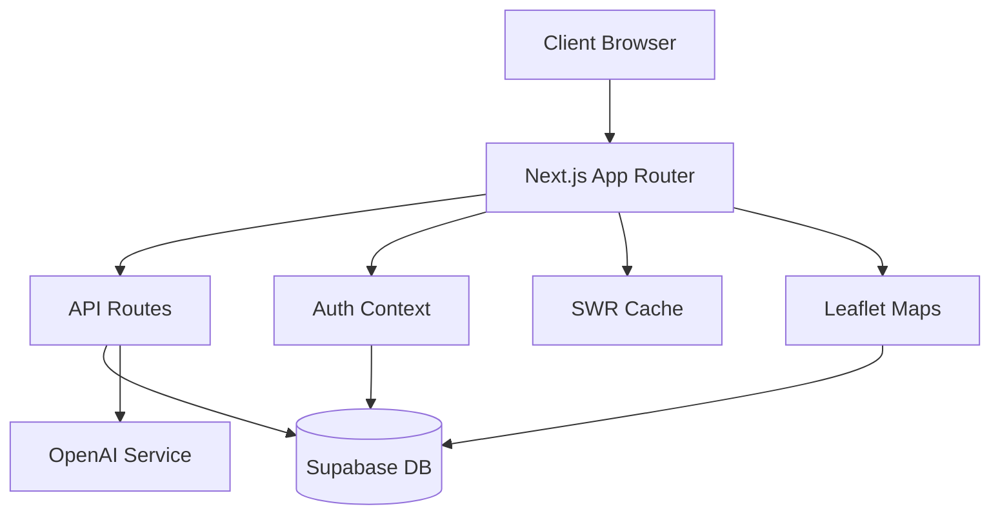

# Technical Architecture Documentation

This document outlines the technical architecture of the Planning Manager application, detailing its components, interactions, and implementation details.

## System Overview

The Planning Manager is built using a modern web application architecture with the following key characteristics:

- **Frontend Framework**: Next.js 14 with App Router
- **Backend Services**: Supabase (PostgreSQL + Authentication)
- **State Management**: React Context + SWR
- **Mapping**: Leaflet.js + React-Leaflet
- **UI Components**: Tailwind CSS + Shadcn/ui
- **AI Integration**: OpenAI API

## Architecture Diagram



## Component Architecture

### Frontend Layer

1. **Page Components**

   ```typescript
   // Example page component structure
   export default function ProjectPage() {
     const { data, error } = useSWR('/api/projects', fetcher)
     const { user } = useAuth()
     
     return (
       <Layout>
         <ProjectHeader />
         <ProjectMap />
         <ProjectDetails />
       </Layout>
     )
   }
   ```

2. **Context Providers**

   ```typescript
   // Auth context setup
   export const AuthProvider = ({ children }) => {
     const [user, setUser] = useState(null)
     const [loading, setLoading] = useState(true)
     
     // Auth state management
     useEffect(() => {
       const { data: authListener } = supabase.auth.onAuthStateChange(
         async (event, session) => {
           setUser(session?.user ?? null)
           setLoading(false)
         }
       )
       
       return () => {
         authListener?.unsubscribe()
       }
     }, [])
     
     return (
       <AuthContext.Provider value={{ user, loading }}>
         {children}
       </AuthContext.Provider>
     )
   }
   ```

3. **Shared Components**

   ```typescript
   // Example reusable component
   interface ButtonProps {
     variant: 'primary' | 'secondary'
     size: 'sm' | 'md' | 'lg'
     children: React.ReactNode
     onClick?: () => void
   }
   
   export const Button = ({
     variant,
     size,
     children,
     onClick
   }: ButtonProps) => {
     return (
       <button
         className={cn(
           buttonVariants({ variant, size })
         )}
         onClick={onClick}
       >
         {children}
       </button>
     )
   }
   ```

### API Layer

1. **Route Handlers**

   ```typescript
   // Example API route
   export async function GET(
     req: Request,
     { params }: { params: { id: string } }
   ) {
     try {
       const { data, error } = await supabase
         .from('projects')
         .select('*')
         .eq('id', params.id)
         .single()
   
       if (error) throw error
       
       return NextResponse.json(data)
     } catch (error) {
       return NextResponse.json(
         { error: 'Failed to fetch project' },
         { status: 500 }
       )
     }
   }
   ```

2. **Middleware**

   ```typescript
   // Authentication middleware
   export async function middleware(req: NextRequest) {
     const token = req.cookies.get('sb-access-token')
   
     if (!token) {
       return NextResponse.redirect(new URL('/login', req.url))
     }
   
     return NextResponse.next()
   }
   
   export const config = {
     matcher: ['/dashboard/:path*', '/projects/:path*']
   }
   ```

### Database Layer

1. **Schema Design**

   ```sql
   -- Core tables
   CREATE TABLE projects (
     id UUID PRIMARY KEY DEFAULT uuid_generate_v4(),
     name TEXT NOT NULL,
     description TEXT,
     status TEXT NOT NULL,
     created_at TIMESTAMPTZ DEFAULT NOW(),
     updated_at TIMESTAMPTZ DEFAULT NOW(),
     user_id UUID REFERENCES auth.users(id)
   );
   
   CREATE TABLE locations (
     id UUID PRIMARY KEY DEFAULT uuid_generate_v4(),
     project_id UUID REFERENCES projects(id),
     geometry GEOMETRY(POINT, 4326),
     properties JSONB DEFAULT '{}'::jsonb
   );
   ```

2. **Row Level Security**

   ```sql
   -- RLS policies
   ALTER TABLE projects ENABLE ROW LEVEL SECURITY;
   
   CREATE POLICY "Users can view their own projects"
     ON projects FOR SELECT
     USING (auth.uid() = user_id);
   
   CREATE POLICY "Users can insert their own projects"
     ON projects FOR INSERT
     WITH CHECK (auth.uid() = user_id);
   ```

### Integration Layer

1. **OpenAI Integration**

   ```typescript
   // AI service setup
   export class AIService {
     private client: OpenAI
   
     constructor() {
       this.client = new OpenAI({
         apiKey: process.env.OPENAI_API_KEY
       })
     }
   
     async analyzeProject(project: Project): Promise<Analysis> {
       const completion = await this.client.chat.completions.create({
         model: "gpt-4",
         messages: [
           {
             role: "system",
             content: "You are a project analysis assistant."
           },
           {
             role: "user",
             content: `Analyze this project: ${JSON.stringify(project)}`
           }
         ]
       })
   
       return this.parseAnalysis(completion.choices[0].message)
     }
   }
   ```

2. **Map Integration**

   ```typescript
   // Map service setup
   export class MapService {
     private map: L.Map
   
     constructor(element: HTMLElement) {
       this.map = L.map(element).setView([51.505, -0.09], 13)
       
       L.tileLayer('https://{s}.tile.openstreetmap.org/{z}/{x}/{y}.png', {
         attribution: '© OpenStreetMap contributors'
       }).addTo(this.map)
     }
   
     addProject(project: Project) {
       const marker = L.marker([
         project.location.coordinates[1],
         project.location.coordinates[0]
       ])
       
       marker.bindPopup(this.createPopupContent(project))
       marker.addTo(this.map)
     }
   }
   ```

## State Management

1. **Global State**

   ```typescript
   // Global state types
   interface GlobalState {
     user: User | null
     projects: Project[]
     selectedProject: Project | null
     filters: FilterState
     ui: UIState
   }
   
   // Context setup
   export const GlobalContext = createContext<{
     state: GlobalState
     dispatch: Dispatch<Action>
   }>({ state: initialState, dispatch: () => null })
   ```

2. **Local State**

   ```typescript
   // Component-level state management
   function ProjectList() {
     const [sortBy, setSortBy] = useState<SortOption>('date')
     const [filterBy, setFilterBy] = useState<FilterOption[]>([])
     
     const sortedProjects = useMemo(() => {
       return projects.sort((a, b) => {
         if (sortBy === 'date') {
           return b.date.getTime() - a.date.getTime()
         }
         // Additional sort logic
       })
     }, [projects, sortBy])
   }
   ```

## Data Flow

1. **Request Flow**

   ```mermaid
   sequenceDiagram
       Client->>+Next.js: Request page
       Next.js->>+API: Fetch data
       API->>+Database: Query
       Database-->>-API: Results
       API-->>-Next.js: JSON response
       Next.js-->>-Client: Rendered page
   ```

2. **State Updates**

   ```mermaid
   sequenceDiagram
       Client->>+Context: Dispatch action
       Context->>+Reducer: Process action
       Reducer->>+State: Update state
       State-->>-Context: New state
       Context-->>-Client: Re-render
   ```

## Security Implementation

1. **Authentication Flow**

   ```typescript
   // Auth utility functions
   export const auth = {
     async signIn(email: string, password: string) {
       const { data, error } = await supabase.auth.signInWithPassword({
         email,
         password
       })
       
       if (error) throw error
       return data
     },
     
     async signOut() {
       const { error } = await supabase.auth.signOut()
       if (error) throw error
     }
   }
   ```

2. **Authorization**

   ```typescript
   // Role-based access control
   export const checkPermission = (
     user: User,
     action: Action,
     resource: Resource
   ): boolean => {
     const userRole = user.role
     const permissions = ROLE_PERMISSIONS[userRole]
     
     return permissions.includes(`${action}:${resource}`)
   }
   ```

## Error Handling

1. **Global Error Boundary**

   ```typescript
   class ErrorBoundary extends React.Component {
     state = { hasError: false, error: null }
   
     static getDerivedStateFromError(error) {
       return { hasError: true, error }
     }
   
     componentDidCatch(error, errorInfo) {
       console.error('Error caught by boundary:', error, errorInfo)
       // Log to error reporting service
     }
   
     render() {
       if (this.state.hasError) {
         return <ErrorFallback error={this.state.error} />
       }
   
       return this.props.children
     }
   }
   ```

2. **API Error Handling**

   ```typescript
   // Error handling middleware
   export async function errorHandler(
     error: unknown,
     req: Request,
     res: Response
   ) {
     if (error instanceof ValidationError) {
       return NextResponse.json(
         { error: error.message },
         { status: 400 }
       )
     }
   
     if (error instanceof AuthError) {
       return NextResponse.json(
         { error: 'Unauthorized' },
         { status: 401 }
       )
     }
   
     console.error(error)
     return NextResponse.json(
       { error: 'Internal server error' },
       { status: 500 }
     )
   }
   ```

## Performance Optimization

1. **Caching Strategy**

   ```typescript
   // SWR configuration
   export const SWRConfig = {
     fetcher: async (url: string) => {
       const res = await fetch(url)
       if (!res.ok) {
         throw new Error('Failed to fetch')
       }
       return res.json()
     },
     revalidateOnFocus: false,
     revalidateOnReconnect: false,
     dedupingInterval: 10000
   }
   ```

2. **Code Splitting**

   ```typescript
   // Dynamic imports
   const ProjectMap = dynamic(
     () => import('@/components/ProjectMap'),
     {
       loading: () => <MapSkeleton />,
       ssr: false
     }
   )
   ```

## Monitoring and Logging

1. **Performance Monitoring**

   ```typescript
   // Performance tracking
   export const trackPerformance = (metric: PerformanceMetric) => {
     if (typeof window !== 'undefined') {
       const entry = performance.mark(metric.name)
       
       // Report to analytics
       analytics.track('Performance', {
         name: metric.name,
         duration: entry.duration,
         timestamp: entry.startTime
       })
     }
   }
   ```

2. **Error Logging**

   ```typescript
   // Error tracking setup
   export const logger = {
     error(error: Error, context?: object) {
       console.error(error)
       
       // Send to error tracking service
       Sentry.captureException(error, {
         extra: context
       })
     },
     
     info(message: string, data?: object) {
       console.log(message, data)
       
       // Send to logging service
       Logger.info(message, data)
     }
   }
   ```

## Deployment Architecture

1. **Production Environment**

   ```mermaid
   graph TD
       Client[Client] --> CDN[CDN]
       CDN --> Vercel[Vercel Edge]
       Vercel --> Next[Next.js Server]
       Next --> Supabase[Supabase]
       Next --> OpenAI[OpenAI API]
   ```

2. **CI/CD Pipeline**

   ```yaml
   # GitHub Actions workflow
   name: CI/CD
   
   on:
     push:
       branches: [ main ]
     pull_request:
       branches: [ main ]
   
   jobs:
     test:
       runs-on: ubuntu-latest
       steps:
         - uses: actions/checkout@v2
         - name: Setup Node.js
           uses: actions/setup-node@v2
           with:
             node-version: '18'
         - name: Install dependencies
           run: npm ci
         - name: Run tests
           run: npm test
   
     deploy:
       needs: test
       runs-on: ubuntu-latest
       if: github.ref == 'refs/heads/main'
       steps:
         - name: Deploy to Vercel
           uses: vercel/action@v2
           with:
             vercel-token: ${{ secrets.VERCEL_TOKEN }}
             vercel-org-id: ${{ secrets.ORG_ID}}
             vercel-project-id: ${{ secrets.PROJECT_ID }}
             vercel-args: '--prod'
   ```

## Future Considerations

1. **Scalability**
   - Implement database sharding
   - Add Redis caching layer
   - Deploy to multiple regions
   - Implement queue system for background jobs

2. **Feature Expansion**
   - Advanced analytics dashboard
   - Real-time collaboration
   - Mobile app development
   - API marketplace

3. **Technical Debt**
   - Code coverage improvement
   - Performance optimization
   - Documentation updates
   - Dependency updates

## Core Features

### Project Management
The system allows transportation planners to manage projects throughout their lifecycle:
- Create and edit project details
- Track project status and milestones
- Associate documents and feedback
- Assign team members

### GIS Integration
Geospatial functionality is core to the application:
- Interactive maps for project visualization
- Drawing tools for creating project geometries
- Spatial analysis for demographic impact
- Integration with transportation network data

### Project Scoring
The system includes a flexible scoring framework:
- Customizable criteria with weights
- Multiple scoring templates
- Automated scoring suggestions
- Prioritization scenarios

### Scenario Development
The application enables planners to evaluate alternative approaches:
- AI-assisted generation of project scenarios
- Comparison between different project alternatives
- Cost-benefit analysis of scenarios
- Refinement based on feedback
- Impact assessment across multiple dimensions

### AI Integration
The system leverages advanced AI capabilities:
- Project analysis using LLMs
- Automated reporting
- Scenario generation and comparison
- Impact predictions
